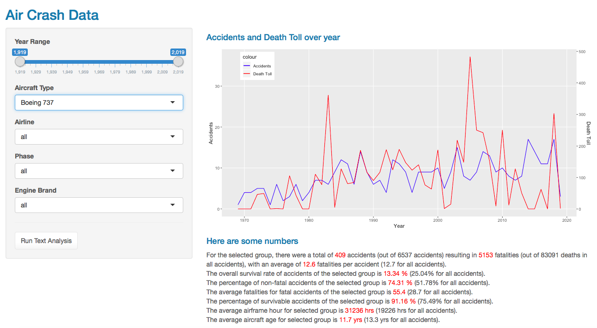
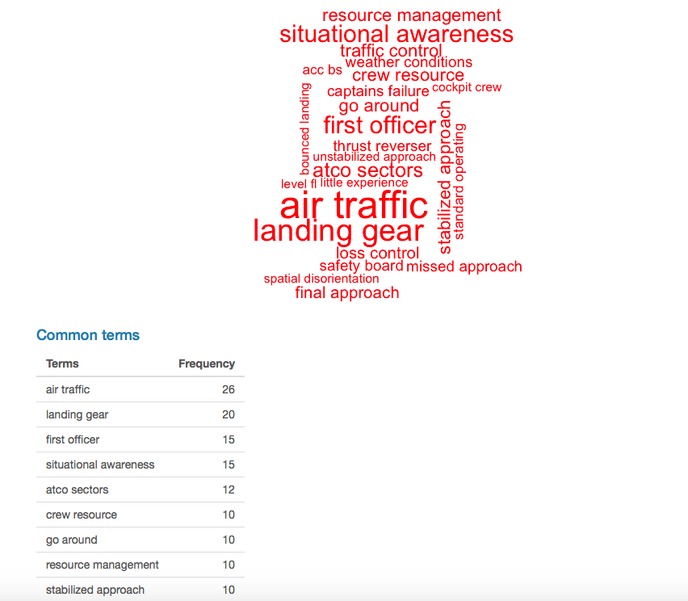

# Project Overview
Air Crash "Investigation"  

For long distance travellers, airplanes have been the only efficient form of transportation. Air travel, throughout the years, also changed from daredevil adventures to daily routines for many people. Contrary to intuition, air travel is the safest form of transportation by many metrics and air crashes are extremely rare. However, when something does go wrong, the consequences are often catastrophic. With myself interested in this subject for a long time, I will take a deeper look at the air crashes in civil aviation history and see what we did not know about air crashes. Whatever the case, keep in mind that you are more likely to experience a lightning strike than a plane crash, probabilistically speaking.  

## Project Goal
* Historical Airline accidents analysis.
* Create and classify cause of accidents from text (not complete).
* Demonstrate and visualize potential risks of certain flights by airlines, aircrafts, engine type, etc.

## 1. Data
I first explored accidents and incidents data from International Civil Aviation Organization ([ICAO](https://www.icao.int/safety/iStars/Pages/API-Data-Service.aspx)). A similar dataset is the report published by National Transportation Safety Board (NTSB) on all incidents and accidents involving an US made airplane (e.g. Boeing) or happened in the US (The former is less detailed where a foreign agency usually takes lead on the investigation). Also, there is a processed dataset on [Opendata](https://opendata.socrata.com/Government/Airplane-Crashes-and-Fatalities-Since-1908/q2te-8cvq) with selected key information about air crashes since 1908. I then discovered that the aforementioned dataset from Opendata could be traced from two websites: [planecrashinfo.com](http://planecrashinfo.com/) and [Aviation Safety Network](https://aviation-safety.net/). However, these two website does not allow for easy export of data and requires web scraping. To summarize, here are the candidate datasets:  

| Source        | Time Span           | Region | Type  | Quality | Availability |
| ------------- | ------------------- | ------ | ----- | ------- | ------------ |
| ICAO      | 2008-  | Worldwide | Accidents & Incidents | No Text | csv |
| NTSB      | 1948- \* | U.S. \*\* | Accidents & Incidents | No Text | xml |
| Opendata/Kaggle | 1908- | Worldwide | Accidents   | Limited Text | csv |
| planecrashinfo | 1908- | Worldwide | Accidents   | Some Text | scraping |
| Aviation Safety Network | 1908- | Worldwide | Accidents   | Detailed Text | scraping |  

\*: Only 4/87212 before 1979  
\*\*: Flights in the U.S. or U.S. manufactured planes

As shown above, [Aviation-Safety Network](https://aviation-safety.net/) has the best overall quality with detailed descriptions of almost all accidents dating back to 1908. Although not exportable, the website organizes the information by year and web-scraping is possible. 

## 2. Data Scraping
[rvest](https://cran.r-project.org/web/packages/rvest/rvest.pdf) package is used for scraping data off of Aviation-Safety Network.  

After accessing the year by year database, the website listed a table of accidents with 100 results shown on each page. However, to access the more detailed description of each accident, you will need to click on the links attached to the date in the table.  

Now at the detailed accident page, the information is not organized as neatly as it was in the previous step. In fact, the layout of accident pages varies from page to page. This inconsistency would make it difficult to pick a node specification that covers only information of interest. Eventually, I decided to do small batches of scraping to find a good node specification that includes all information desired and requires manageable data cleaning.  

## 3. Data Cleaning
Data cleaning was quite complex for this dataset. With over 21,000 lists of scraped web page information, I first identified the list elements that are titles/column names (Status, Date, Type, etc.) in the dataset. Then, I filtered out these title information and transform these lists into a single row record with headers. Due to the inconsistency problems explained before, I had to write a function that discards the redundant scraped information. After merging, the initial dataset was saved as a .csv file in the folder as "ANData.csv."  

Further cleaning is done in both Microsoft Excel and RStudio and the file is saved as "ANData_processed.csv." The initial analysis is done with this dataset.  

Lastly, several fields have to be fixed for inconsistencies and other data quality issues with regular expression.  

## 4. Data Processing - Geocoding
Using geocoding, I will transform the existing text description of locations (departure airport, destination airport, crash site) to latitudes and longitudes. After registering, I could make 2,500 (Google Map) geocoding queries per day with Google's API key. However, Google cannot interpret relative locations and only produce the coordinates from the location mentioned in the text. For example, Google is only able to give me the coordinates to JFK Airport for an address that reads "50 miles SE of JFK Airport." Therefore, I have to find the crash site location from the coordinates provided by Google with geosphere package (spherical path).  

After adjustments, distance metrics all also generated.

## 5. Text Analysis
### i. Bag of Words
Bag of words analysis is conducted for two reasons. For one, it can help visualize the main factors for certain accidents. Also, it facilitates dictionary based text analysis with the frequent terms generated from bag of words analysis. After testing, a bigram is more meaningful and suitable for this dataset.  

### ii. Dictionary Based Text Analysis
The initial dictionary is created from web sources ( [Skybrary](https://www.skybrary.aero/index.php/Main_Page#operational-issues) and [PlaneCrashInfo](http://www.planecrashinfo.com/cause.htm)). After bag of words text analysis, more terms are added to the dictionary for different categories of probable cause (pilot error, mechanical failure, weather, sabotage, others). Text classification is conducted with the updated dictionary but many accidents remain unidentified. Next step is to pursue text classification with RNN approach (in the future).

## 6. Shiny application
A shiny app is created with the final dataset and any user is free to explore and conduct his or her own analysis on civil aviation accidents. Several filters are also prodived and people could use this application to learn about potential risks of certain flights. 

