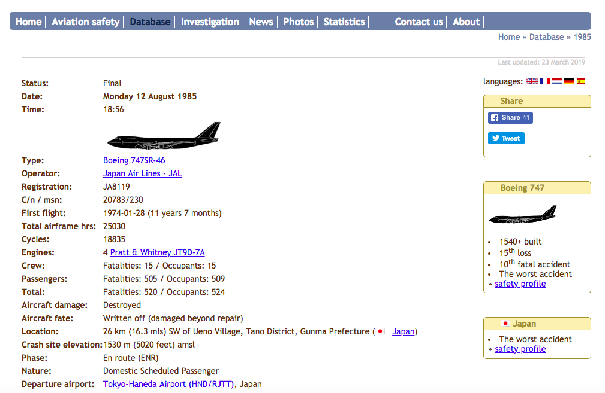

```{r md_setup, include = FALSE}
knitr::opts_chunk$set(echo = TRUE)
knitr::opts_chunk$set(include = TRUE)
knitr::opts_chunk$set(tidy.opts = list(width.cutoff = 60), tidy = TRUE, warning = F)
require(tidyverse)
require(lubridate)
require(knitr)
require(XML)
require(rvest)
require(utf8)
#require(qdap)
require(tm)
require(wordcloud)
require(RWeka)
require(ggmap)
require(geosphere)

# ggplot theme
theme1 <- list(theme(panel.grid.minor = element_blank(),
                    plot.background = element_blank()))

options(scipen = 999)
```

# Project Overview

For long distance travellers, airplanes have been the only efficient form of transportation. Air travel, throughout the years, also changed from daredevil adventures to daily routines for many people. Contrary to intuition, air travel is the safest form of transportation by many metrics and air crashes are extremely rare. However, when something does go wrong, the consequences are often catastrophic. With myself interested in this subject for a long time, I will take a deeper look at the air crashes in civil aviation history and see what we did not know about air crashes. Whatever the case, keep in mind that you are more likely to experience a lightning strike than a plane crash, probabilistically speaking.  

I will leverage several datasets to explore this topic from different angles. The main objective of this project is to discover things that the average Joe doesn't know about aircraft safety. 

# Project Goals
* How to better your chance of survival in case of a certain type of emergency
* Predict and assess the risk level of certain flights 

# Data Preparation

##1. Data source
Many data sources were explored initially and comparisons were made among them in the following table.  

| Source        | Time Span           | Region | Type  | Quality | Availability |
| ------------- | ------------------- | ------ | ----- | ------- | ------------ |
| ICAO      | 2008-  | Worldwide | Accidents & Incidents | No Text | csv |
| NTSB      | 1948- \* | U.S. \*\* | Accidents & Incidents | No Text | xml |
| Opendata/Kaggle | 1908- | Worldwide | Accidents   | Limited Text | csv |
| planecrashinfo | 1908- | Worldwide | Accidents   | Some Text | scraping |
| Aviation Safety Network | 1908- | Worldwide | Accidents   | Detailed Text | scraping |  

\*: Only 4/87212 before 1979  
\*\*: Flights in the U.S. or U.S. manufactured planes

As shown above, [Aviation-Safety Network](https://aviation-safety.net/) has the best overall quality with detailed descriptions of almost all accidents dating back to 1908. Although not exportable, the website organizes the information by year and web-scraping is possible. 


##2. Data Scraping
[rvest](https://cran.r-project.org/web/packages/rvest/rvest.pdf) package is used for scraping data off of Aviation-Safety Network.  

After accessing the year by year database, the website listed a table of accidents with 100 results shown on each page. However, to access the more detailed description of each accident, you will need to click on the links attached to the date in the table.  


Now at the detailed accident page, the information is not organized as neatly as it was in the previous step. In fact, the layout of accident pages varies from page to page. This inconsistency would make it difficult to pick a node specification that covers only information of interest. Eventually, I decided to do small batches of scraping to find a good node specification that includes all information desired and requires manageable data cleaning.  



With the help of [SelectorGadget](https://selectorgadget.com/), I first compiled a list of links to the accident pages (attached to the date shown in figure.3) in url. Then I selected the objects using node ID on the accident pages and convert the information into a list object in R. Eventually, the data were scraped by 20 year intervals.  

##3. Data Cleaning
Data cleaning was quite complex for this dataset. With over 21,000 lists of scraped web page information, I first identified the list elements that are titles/column names (Status, Date, Type, etc.) in the dataset. Then, I filtered out these title information and transform these lists into a single row record with headers. Due to the inconsistency problems explained before, I had to write a function that discards the redundant scraped information. After merging, the initial dataset was saved as a .csv file in the folder as "ANData.csv."  

Further cleaning is done in both Microsoft Excel and RStudio and the file is saved as "ANData_processed.csv." The initial analysis is done with this dataset.  

# Initial analysis
## Loading data
```{r}
df.raw <- read.csv("data/ANData.csv", stringsAsFactors = F)

# eliminate empty record (1 row)
df.raw <- df.raw[which(is.na(df.raw$Status.) == FALSE), ]

df.all.flights <- read.csv("data/ANData_processed.csv", stringsAsFactors = F)

# replace with original encoding (so non-english characters are displayed properly)
df.all.flights$Type <- df.raw$Type.
df.all.flights$Operator <- df.raw$Operator.
df.all.flights$Location <- df.raw$Location.
df.all.flights$Probable.Cause <- df.raw$Probable.Cause.
df.all.flights$Narrative <- df.raw$Narrative.
df.all.flights$Date <- df.raw$Date.
df.all.flights$Date <- as.Date(df.all.flights$Date, format = "%A %d %B %Y")
df.all.flights$Phase <- gsub(" {1}$", "", df.all.flights$Phase)
df.all.flights$Location <- gsub('([0-9]),([0-9])', '\\1.\\2', df.all.flights$Location)
df.all.flights$Departure.airport <- df.raw$Departure.airport.
df.all.flights$Destination.airport <- df.raw$Destination.airport.
df.all.flights$Time.new <- ifelse(nchar(df.all.flights$Time.new) == 4, paste0("0", df.all.flights$Time.new), df.all.flights$Time.new)
#df.all.flights$Time.new <- as.POSIXct(df.all.flights$Time.new, format = "%H:%M")

```

## Passenger Airplane
```{r}
df.civil <- df.all.flights %>% filter(grepl("Passenger", Nature))

#fix survival stats
df.civil$Crew.total[which(df.civil$Occupants.total == 0)] <- NA
df.civil$Passengers.total[which(df.civil$Occupants.total == 0)] <- NA
df.civil$Occupants.total[which(df.civil$Occupants.total == 0)] <- NA

df.civil <- add_column(df.civil, Survivable = as.numeric(df.civil$Occupants.total > df.civil$Total.fatalities), .after = "Occupants.total")

#fix aircraft type
aircrafts <- read.csv("data/all_aircrafts.csv", stringsAsFactors = F)

df.civil <- add_column(df.civil, Type.new = df.civil$Type, .after = "Type")

for (i in 1:dim(aircrafts)[1]) {
  df.civil$Type.new <- gsub(paste0('^.*', aircrafts[i, 2], '.*$'), paste0(aircrafts[i, 1]),df.civil$Type.new)
}

# create airplane age, use Jan.1st for date for those planes whose first flight is only known by year
df.civil <- add_column(df.civil, First.flight.date = ifelse(grepl("^.*\\(.*$", df.civil$First.flight), substr(df.civil$First.flight, 2, 11), ifelse(df.civil$First.flight == " ", NA, paste0(df.civil$First.flight, "-01-01"))), .after = "First.flight.year") 

df.civil <- add_column(df.civil, Age = ifelse(is.na(df.civil$First.flight.date), NA, round(as.numeric(difftime(df.civil$Date, df.civil$First.flight.date, units = "weeks")/52.25), 1)), .after = "First.flight.date")

# Add time of day as hour
df.civil <- add_column(df.civil, Hour = ifelse(is.na(df.civil$Time.new), NA, round(as.numeric(substr(df.civil$Time.new, 1, 2)) + as.numeric(substr(df.civil$Time.new, 4, 5))/60, 2)), .after = "Time.new")

# Complete date
df.civil$Date[which(is.na(df.civil$Date))] <- as.Date(c("1949-11-30", "1946-04-30", "1942-01-31", "1974-02-28", "1973-01-31", "1985-04-30", "2011-10-31", "2002-01-31"))
```


## Future Steps
* Analyze narrative and probable cause columns in the dataset with NLP
* Search for lists of aviation terms and phrases to help parse the texts
* Link this dataset to other datasets about incidents and overall civil aviation service (for accident rates)


#### Geocoding
```{r}
df.civil$LocRef <- ifelse(grepl("([ESWN]) of .*$", df.civil$Location), gsub("([ESWN]) of .*$", "\\1", df.civil$Location), NA)

# get rid of ca
df.civil$LocRef <- gsub("^ca ", "", df.civil$LocRef)

# grab the distance in km
df.civil$distdiff <- ifelse(grepl("^([+-]?(\\d*\\.)?\\d+) .*$", df.civil$LocRef), gsub("^([+-]?(\\d*\\.)?\\d+) .*$", "\\1", df.civil$LocRef), NA)
df.civil$directions <- ifelse(is.na(df.civil$distdiff), NA, gsub("^.* ([ESWN]+)$", "\\1", df.civil$LocRef))

# create key to match bearing to degree
#directions <- unique(df.civil$directions[!is.na(df.civil$directions)])
# bearing, N: 0, E: 90, S: -180, W: -90
#bearings <- c(135, -45, 0, -180, -112.5, -135, 45, 67.5, 90, -90, 22.5, 157.5, -67.5, -157.5, -22.5, 112.5)
#bearing_key <- data.frame(directions, bearings)
#write_csv(bearing_key, "data/directions.csv")

bearing_key <- read.csv("data/directions.csv")
df.civil <- left_join(df.civil, bearing_key)

# 2500 limit per day
#register_google(key = "*************")

#coord1 <- geocode(df.civil$Location[1:2200])
#coord2 <- geocode(df.civil$Location[2201:4400])
#coord3 <- geocode(df.civil$Location[4401:6537])

#depart1 <- geocode(df.civil$Departure.airport[1:2400])
#depart2 <- geocode(df.civil$Departure.airport[2401:4800])
#depart3 <- geocode(df.civil$Departure.airport[4801:6537])
#dest1 <- geocode(df.civil$Destination.airport[1:2400])
#dest2 <- geocode(df.civil$Destination.airport[2401:4800])
#dest3 <- geocode(df.civil$Destination.airport[4801:6537])
#depart.all <- rbind(depart1, depart2, depart3)
#dest.all <- rbind(dest1, dest2, dest3)

#airport <- cbind(depart.all, dest.all)
#write.csv(airport, "data/airports.csv")
#depart2 <- geocode()

#location <- rbind.data.frame(coord1, coord2, coord3)
#write.csv(location, "data/crash_coord.csv")

location <- read.csv("data/crash_coord.csv")

location <- data.frame(lon = location$lon, lat = location$lat)

location_adj <- data.frame(matrix(rep(NA, nrow(location) * 2), ncol = 2, byrow = T))

for (i in 1:nrow(location)) {
  location_adj[i, 1] <- unname(ifelse(is.na(df.civil$distdiff[i]), location[i, 1], destPoint(p = location[i, ], b = df.civil$bearings[i], d = as.numeric(df.civil$distdiff[i]) * 1000)[[1]]))
  location_adj[i, 2] <- unname(ifelse(is.na(df.civil$distdiff[i]), location[i, 2], destPoint(p = location[i, ], b = df.civil$bearings[i], d = as.numeric(df.civil$distdiff[i]) * 1000)[[2]]))
}

airports <- read.csv("data/airports.csv")
airports <- data.frame(dep.lon = airports$lon, dep.lat = airports$lat, des.lon = airports$lon.1, des.lat = airports$lat.1)

df.civil <- cbind.data.frame(df.civil, location, airports)

# Create distance vectors (total, distance covered)
df.civil$flight.plan.dist <- distGeo(df.civil[, c("dep.lon", "dep.lat")], df.civil[, c("des.lon", "des.lat")])/1000
df.civil$dist.flown <- distGeo(df.civil[, c("dep.lon", "dep.lat")], df.civil[, c("lon", "lat")])/1000
```

### Dictionary

### Convert text columns to lower case
```{r}
df.civil <- df.civil %>% mutate(text = tolower(paste(Narrative, Probable.Cause)))
```

### Create Dictionary

http://www.planecrashinfo.com/cause.htm
```{r}
pilot.error <- c("Improper procedure",
"VFR into IFR",
"Controlled flight into terrain",
"Below minima",
"Spatial disorientation",
"Premature descent",
"Excessive landing speed",
"Missed runway",
"Fuel starvation",
"Fuel exhaustion",
"Navigation error",
"Wrong runway takeoff/landing",
"Midair collision",
"Pilot fatigue",
"tired",
"Judg",
"negligence",
"pre-mature",
"premature",
"unauthorized",
"failure of the captain",
"failure of the pilot",
"pilot error",
"experience",
"inadequate",
"improper"
)

mechanical.failure <- c("Engine failure",
"Engine problem",
"loss of power",
"Equipment failure",
"Equipment problem",
"Structural failure",
"fracture",
"disintegrate",
"Design flaw",
"Metal fatigue",
"electric system",
"overheating",
"auto pilot",
"automatic pilot",
"Maintenance")

weather <- c("turbulence",
"Windshear",
"Mountain wave",
"Poor visibility",
"bad visibility",
"limited visibility",
"Heavy rain",
"Severe wind",
"high wind",
"crosswind",
"fog",
"Icing",
"Thunderstorm",
"Lightning strike",
"weather condition",
"meteorological",
"atmospheric")

sabotage <- c("Hijack",
"Shot down",
"Explosive device",
"police")

other.factors <- c("ATC error",
"Ground crew error",
"Maximum takeoff weight",
"Overloaded",
"Improperly loaded cargo",
"Bird strike",
"Fuel contamination",
"Pilot incapacitation",
"Obstruction on runway",
"Midair collision caused by other plane",
"Fire in flight",
"Smoke in flight",
"training")
```

```{r}
#Search dictionary function
check_term <- function(term, text) {
  status <- rep(0, length(text))
  for (i in 1:length(term)) {
    tmp_check <- str_detect(text, tolower(term[i]))
    status <- status | tmp_check
  }
  status <- as.numeric(status)
  status[is.na(status)] <- 0
  return(list(vector = status, count = sum(status)))
}
```

# dictionary check
```{r}
df.civil$pilot.error <- check_term(pilot.error, df.civil$text)$vector
df.civil$mechanical.failure <- check_term(mechanical.failure, df.civil$text)$vector
df.civil$weather <- check_term(weather, df.civil$text)$vector
df.civil$sabotage <- check_term(sabotage, df.civil$text)$vector
df.civil$other.factors <- check_term(other.factors, df.civil$text)$vector

#total <- df.civil$pilot.error | df.civil$mechanical.failure | df.civil$weather | df.civil$sabotage | df.civil$other.factors | is.na(df.civil$Probable.Cause)

#write.csv(df.civil, "data/data_for_vis.csv", row.names = F)
#testdf <- read.csv("data/data_for_vis.csv", stringsAsFactors = F)
```


```{r}

corpus <- VCorpus(VectorSource(df.civil$text[which(df.civil$text != " na")]))
corpus <- tm_map(corpus, PlainTextDocument)
corpus <- tm_map(corpus, removePunctuation)
corpus <- tm_map(corpus, removeNumbers)
corpus <- tm_map(corpus, removeWords, c(stopwords("english"), "flight", "plane", "aircraft", "probable", "cause"))
dtm <- DocumentTermMatrix(corpus)
dtm <- removeSparseTerms(dtm, 0.95)

freq_terms <- findFreqTerms(dtm,100)

corpus2 <- VCorpus(VectorSource(tolower(df.civil$Probable.Cause[!is.na(df.civil$Probable.Cause)])))
corpus2 <- corpus2 %>% tm_map(PlainTextDocument) %>% tm_map(removeNumbers) %>% tm_map(removePunctuation) %>% tm_map(removeWords, c(stopwords("en"), stopwords("french"), stopwords("spanish"), "flight", "plane", "aircraft", "probable", "cause", "accident", "airplane", "account", "according"))
# corpus2 <- tm_map(corpus2, PlainTextDocument)
# corpus2 <- tm_map(corpus2, removeNumbers)
# corpus2 <- tm_map(corpus2, removePunctuation)
# corpus2 <- tm_map(corpus2, removeWords, c(stopwords("en"), stopwords("french"), stopwords("spanish"), "flight", "plane", "aircraft", "probable", "cause", "accident", "airplane", "account", "according"))

dtm2 <- DocumentTermMatrix(corpus2)
dtm2 <- removeSparseTerms(dtm2, 0.98)

freq_terms2 <- findFreqTerms(dtm2, 100)

#library(RWeka)

tokenizer <- function(x) {
  NGramTokenizer(x, Weka_control(min = 2, max = 2))
}


bigram_dtm <- DocumentTermMatrix(corpus2, control = list(tokenize = tokenizer))

bigram_dtm_m <- as.matrix(bigram_dtm)

freq <- colSums(bigram_dtm_m)

bi_words <- names(freq)

wordcloud(bi_words, freq, max.words = 30)

sort(freq, decreasing = T)[1:10]

test <- sort(freq, decreasing = T)[1:10]
test_df <- data.frame("Common.Terms" = as.character(names(test)), "Frequency" = as.numeric(test))
```

```{r}
p1 <- df.civil %>% group_by(Year) %>% summarise(Accidents = n(), Death = sum(Total.fatalities, na.rm = T)) %>% ggplot(aes(x = Year)) + geom_line(aes(y = Accidents, col = "Accidents")) + geom_line(aes(y = Death/13, col = "Death Toll")) + scale_y_continuous(name = "Accidents", sec.axis = sec_axis(~.*13, name = "Death Toll")) + scale_color_manual(values = c("blue", "red")) + ggtitle(label = "Passenger Airplane Accidents by Year") + theme1 + theme(legend.position = c(0.1, 0.9))

p1
```

## Time and Phase of Accidents
```{r}
p2 <- df.civil %>% filter(!is.na(Time.new)) %>% select(Phase, Time.new) %>% mutate(Hour = hour(hm(Time.new))) %>% ggplot(aes(x = Hour)) + geom_histogram(binwidth = 1, col = "red", alpha = 0.5) + ggtitle(label = "Passenger Airplane Accidents by Hour")

p2

dfPhase <- df.civil %>% filter(!is.na(Time.new)) %>% select(Phase, Time.new) %>% mutate(Hour = hour(hm(Time.new))) %>% group_by(Phase) %>% summarise(Accidents = n())

dfPhase$Phase <- factor(dfPhase$Phase, levels = dfPhase$Phase[order(-dfPhase$Accidents)])
  
p3 <- ggplot(dfPhase, aes(x = Phase, y = Accidents)) + geom_bar(stat = "identity", col = "red", alpha = 0.5) + ggtitle(label = "Passenger Airplane Accidents by Phase") + scale_x_discrete(labels = function(x) str_wrap(x, width = 10)) + theme(axis.text = element_text(size = 8))

p3 
#+ ggplot2::annotate("text", x = 2, y = 900, label = "27.5%")
```

## Engine Type
```{r}
engines <- df.civil %>% filter(!is.na(Engines)) %>% select(Engine.count, Engine.brand, Engine.type)

# brand
p4 <- engines %>% group_by(Engine.brand) %>% summarise(Accidents = n()) %>% filter(Accidents >= 25) %>% ggplot(aes(x = Engine.brand, y = Accidents)) + geom_bar(stat = "identity", col = "red", alpha = 0.5) + xlab(label = "Brand") + scale_x_discrete(labels = function(x) str_wrap(x, width = 10)) + ggtitle(label = "Passenger Airplane Accidents by Engine Brand (n >= 25)") + theme(axis.text = element_text(size = 6))

p4
```


```{r}
p5 <- ggplot(df.civil, aes(x = Hour, col = factor(sabotage), fill = factor(sabotage))) + geom_density(alpha = 0.3) + scale_x_continuous(limits = c(0, 24), expand = c(0, 0)) + ggtitle(label = "Density for Time of day of accidents by sabotage")

p5
```


```{r}
df1 <- df.civil %>% mutate(geocheck = abs(dep.lon - lon) >= 0.00001 & abs(dep.lat - lat) >= 0.00001 & abs(des.lon - lon) >= 0.00001 & abs(des.lat - lat) >= 0.00001 & abs(des.lon - dep.lon) >= 0.00001 & abs(des.lat - dep.lat) >= 0.00001)

df2 <- df1 %>% filter(geocheck == T, Year >= 1980, Year <= 1985)

worldmap <- borders("world", colour="#f2ffe6", fill="#f2ffe6")
p6 <- ggplot() + worldmap + 
 geom_curve(data = df2, aes(x = dep.lon, y = dep.lat, xend = lon, yend = lat), size = 0.2, col = "#ff9999", curvature = .2) + 
 #geom_curve(data = df2, aes(x = lon, y = lat, xend = des.lon, yend = des.lat), size = 0.1, linetype = "dashed", col = "#ff9999", curvature = .2) + 
 #geom_point(data = df2, aes(x = dep.lon, y = dep.lat), col = "#000d1a", size = 0.1) + 
 #geom_point(data = df2, aes(x = des.lon, y = des.lat), col = "#000d1a", size = 0.1) + 
 geom_point(data = df1 %>% filter(Year >= 1980, Year <= 1985), aes(x = lon, y = lat), shape = 13, col = "#ff0000", size = 1) + 
 theme(panel.background = element_rect(fill = "white"), 
 axis.line = element_blank(),
 axis.text.x = element_blank(),
 axis.text.y = element_blank(),
 axis.ticks = element_blank(),
 axis.title.x = element_blank(),
 axis.title.y = element_blank()
 )


```

